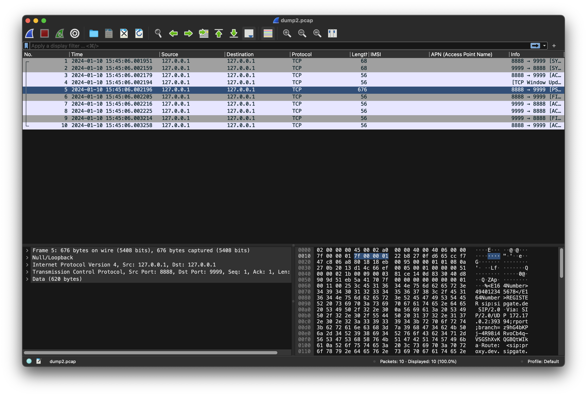
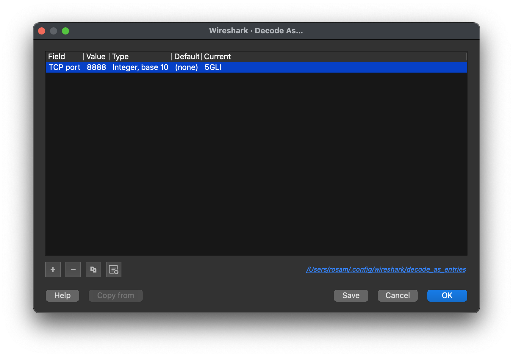
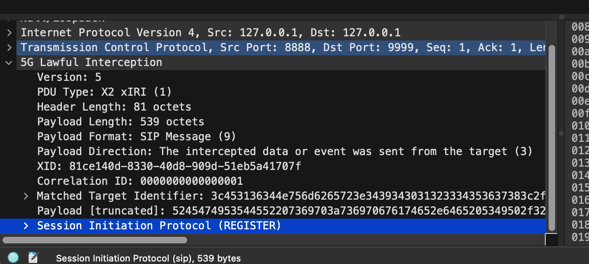

# Minimalistic X2 / X3 LI example

See: [ETSI TS 103 221-2](https://www.etsi.org/deliver/etsi_ts/103200_103299/10322102/01.06.01_60/ts_10322102v010601p.pdf)

This script generates a X2 (X3) compliant TCP network packet (without the required TLS encryption). I've created this
to understand how the protocol works.

## About the protocol

The protocol is used for lawful interception (e.g. Police) of communication signaling and content. It's relatively
simple:

- Based on TCP (Usually TLS 1.2 or newer encrypted - omitted here)
- Contains a simple header with some metadata (like XID - the ID of the lawful interception task)
- After that, the raw payload is simply appended

In Practice, it looks like this:

| Field                        | Length (octets) | Description                                                                                              |
|------------------------------|-----------------|----------------------------------------------------------------------------------------------------------|
| Version                      | 2               | Major + Minor (Current 0x00 0x05)                                                                        | 
| PDU Type                     | 2               | X2 (0x1), X3 (0x2), Keepalive (0x3), Keepalive ack (0x4). In this example: 0x1 (X2)                      |   
| Header length                | 4               | The length of the header in octets (min 40 as of current spec                                            |
| Payload length               | 4               | The length of the payload after the header in octets                                                     |
| Payload format               | 2               | The format of the payload. In this example script 0x9 (SIP Message) is used                              |
| Payload direction            | 2               | The direction of traffic flow. (0x3 = From target used in example)                                       |
| XID                          | 16              | UUID as 128-Bit int of lawful interception task ID (X1 Interface)                                        |
| Correlation ID               | 8               | Used to correlate a dialog (e.g. SIP dialog, or distinct audio streams). In this example, it is just "1" |
| Conditional Attribute fields | Variable        | Type-Length-Value encoded conditional attributes. In this example, a single e164 number                  |
| Payload                      | Variable        | The raw payload (SIP message, RTP Packet, etc.)                                                          |

## Create a packet + dissect in wireshark

```shell
# start TCPDUMP capture on loopback device (lo0 on macos, lo on unix)

tcpdump -i lo0 -w dump.pcap port 9999

# Start a dummy server to accept the connection + packet

nc -l -p 9999

# Run the script
python3 main.py
```

After that, quit tcpdump (CTRL+C) and open the capture file in wireshark.

Find the largest packet of the dump, in this case frame 5:


Right click it and select "Decode as". In the following dialog, select "5GLI" as type:


Then, inspect the dissected packet:
